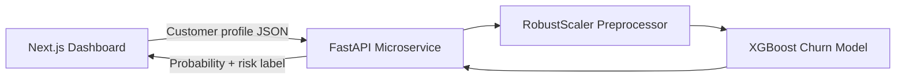

# Customer Risk Intelligence (Bank Churn Predictor)


An end-to-end, full-stack machine learning application designed to predict bank customer churn. This project bridges the gap between mathematical data science and production-grade software engineering by serving an **XGBoost** ensemble model through a **FastAPI** microservice and consuming it from a modern **Next.js** dashboard.

---

## Table of Contents

- [The Business Problem](#the-business-problem)
- [System Architecture](#system-architecture)
- [Directory Structure](#directory-structure)
- [The Machine Learning Pipeline](#the-machine-learning-pipeline)
- [Getting Started](#getting-started)
- [Production Deployment Strategy](#production-deployment-strategy)

---

## The Business Problem

In the financial sector, **customer acquisition is historically 5 to 25 times more expensive than customer retention**. When a bank loses a customer, also known as churn, it loses the immediate account balance and years of future lifetime value.

Standard linear models often fail to predict churn because human behavior is deeply non-linear. A customer does not leave simply because they turn 45. They may leave because of a cascading intersection of variables, such as being older, holding multiple products, living in a specific region, and showing lower engagement.

This project addresses that challenge by deploying a tree-based ensemble architecture capable of mapping complex behavioral boundaries. The goal is to help financial institutions flag at-risk customers before they exit, protecting operational revenue and improving retention strategy.

---

## System Architecture

This project is structured as a **monorepo**, separating the machine learning backend from the client-side interface for a cleaner and more scalable deployment model.

| Layer | Technology |
| --- | --- |
| Frontend client | Next.js, React, Tailwind CSS, TypeScript |
| Backend API | Python, FastAPI, Uvicorn, Pydantic |
| Machine learning engine | scikit-learn, XGBoost, pandas, joblib |



---

## Directory Structure

```text
bank-churn-predictor/
|
|-- client/                          # Next.js application
|   |-- app/                         # React components and dashboard UI
|   |-- package.json
|   |-- next.config.ts
|   |-- tsconfig.json
|   `-- eslint.config.mjs
|
|-- ml_model_api/                    # Python microservice
|   |-- models/
|   |   |-- xgboost_churn_model.joblib   # Serialized champion model
|   |   `-- robust_scaler.joblib         # Serialized preprocessor
|   |-- app.py                           # FastAPI routes and inference logic
|   `-- requirements.txt
|
`-- README.md
```

---

## The Machine Learning Pipeline

The predictive model was developed through a disciplined progression from a simple baseline to an optimized ensemble champion.

### 1. Feature Engineering and Preprocessing

To optimize inference speed and reduce noise, low-impact features such as `Tenure`, `HasCrCard`, and `EstimatedSalary` were removed from the pipeline.

Categorical variables such as `Geography` and `Gender` were one-hot encoded. Continuous variables were standardized using a `RobustScaler` to reduce the impact of outliers and prevent scale distortion during model training.

### 2. Architectural Evolution

| Model | Result | Key Learning |
| --- | --- | --- |
| Logistic Regression | 81% accuracy, but only captured 21% of actual churners | Accuracy alone was misleading because of class imbalance |
| Random Forest | Around 70% precision | Stronger precision, but still missed many true flight risks |
| XGBoost | F1-score of 0.61 and captured 69% of churners | Best balance between business recall and prediction quality |

The final model uses **XGBoost**, a sequential gradient boosting algorithm that improves by correcting errors made by prior trees. This makes it especially effective for identifying non-linear churn behavior across customer profile combinations.

### 3. Threshold Optimization

By default, many machine learning classifiers assume a probability threshold of `0.50`. For this project, the Precision-Recall curve was analyzed and the maximum harmonic mean, or F1-score, was used to engineer a more appropriate decision boundary.

The final optimized threshold is:

```text
0.5877
```

This threshold is applied inside the FastAPI server so the dashboard displays mathematically validated risk alerts instead of relying on the default classifier cutoff.

---

## Getting Started

To run the full-stack application locally, start the backend and frontend in separate terminal windows.

### Prerequisites

- Python 3.10 or newer
- Node.js and npm

### Part 1: Start the AI Backend

Navigate to the API directory:

```bash
cd ml_model_api
```

Create and activate a virtual environment:

```bash
python -m venv venv
```

On macOS or Linux:

```bash
source venv/bin/activate
```

On Windows:

```powershell
.\venv\Scripts\activate
```

Install the MLOps dependencies:

```bash
pip install -r requirements.txt
```

Boot the FastAPI server:

```bash
uvicorn app:app --reload
```

The API will be live at:

```text
http://localhost:8000
```

The automated Swagger UI will be available at:

```text
http://localhost:8000/docs
```

### Part 2: Start the Next.js Client

Navigate to the client directory:

```bash
cd client
```

Install dependencies:

```bash
npm install
```

Start the development server:

```bash
npm run dev
```

The interactive dashboard will be live at:

```text
http://localhost:3000
```

---

## Production Deployment Strategy

This monorepo is designed for decoupled cloud deployment.

| Surface | Strategy |
| --- | --- |
| Backend API | Deploy as a Python web service on Render, AWS EC2, or a similar platform |
| Frontend UI | Deploy on Vercel or another edge-network frontend host |

The frontend should fetch live prediction data from the deployed Python microservice through REST endpoints. In production, the API URL should be moved into an environment variable, and the FastAPI CORS allowlist should be updated for the deployed frontend domain.
