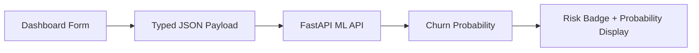

# Bank Churn Predictor Client

Frontend dashboard for the **Customer Risk Intelligence: Bank Churn Predictor** project. This Next.js application lets users adjust customer profile parameters, send them to the FastAPI machine learning service, and view the predicted churn probability in real time.

For the complete project overview, architecture, backend API contract, ML pipeline, and deployment notes, see the root README:

```text
../README.md
```

---

## What This App Does

- Provides an interactive customer-risk dashboard.
- Collects the exact feature set expected by the ML inference API.
- Sends prediction requests to the FastAPI backend at `http://localhost:8000/api/v1/predict/churn`.
- Displays churn probability, risk classification, and threshold-based decision output.
- Uses typed React state so form values match the backend request contract.

---

## Tech Stack

| Layer | Tools |
| --- | --- |
| Framework | Next.js 16 |
| UI Runtime | React 19 |
| Language | TypeScript |
| Styling | Tailwind CSS 4 |
| Quality | ESLint |

---

## Project Structure

```text
client/
|
|-- app/
|   |-- page.tsx        # Main churn-risk dashboard
|   |-- layout.tsx      # Root layout
|   `-- globals.css     # Global styles
|
|-- public/             # Static assets
|-- package.json        # Scripts and dependencies
|-- next.config.ts      # Next.js configuration
|-- tsconfig.json       # TypeScript configuration
`-- eslint.config.mjs   # ESLint configuration
```

---

## Local Development

From the `client/` directory, start the backend in a separate terminal:

```powershell
cd ..\ml_model_api
.\venv\Scripts\activate
uvicorn app:app --reload
```

Then start the frontend:

```powershell
cd ..\client
npm install
npm run dev
```

Open the dashboard:

```text
http://localhost:3000
```

The API must be running at:

```text
http://localhost:8000
```

---

## Available Scripts

```powershell
npm run dev
```

Starts the development server.

```powershell
npm run build
```

Creates a production build.

```powershell
npm run start
```

Runs the production build locally.

```powershell
npm run lint
```

Runs the ESLint checks.

---

## Prediction Flow



The frontend sends this payload shape:

```json
{
  "CreditScore": 650,
  "Age": 40,
  "Balance": 50000,
  "NumOfProducts": 2,
  "IsActiveMember": 1,
  "Geography_Germany": 0,
  "Geography_Spain": 0,
  "Gender_Male": 1
}
```

Expected API response:

```json
{
  "churn_probability": 0.1734,
  "is_flight_risk": false,
  "threshold_applied": 0.5877
}
```

---

## Production Notes

Before deploying this client:

- Move the backend URL into an environment variable.
- Add explicit loading and error states for unavailable API responses.
- Update the backend CORS allowlist for the deployed frontend domain.
- Run `npm run build` to confirm the production bundle compiles successfully.

---

## Role In The Full System

This client is the user-facing layer of the churn prediction system. It turns model inference into a product-like experience: operators can change customer attributes, execute a prediction, and immediately see whether the profile crosses the tuned retention-risk threshold.
